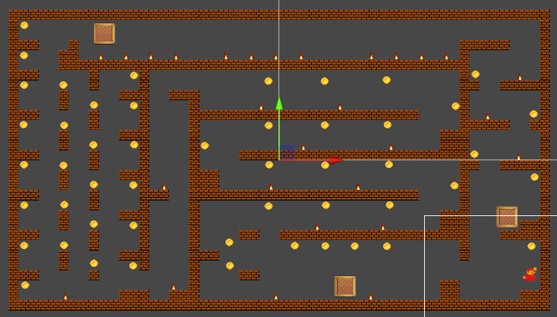
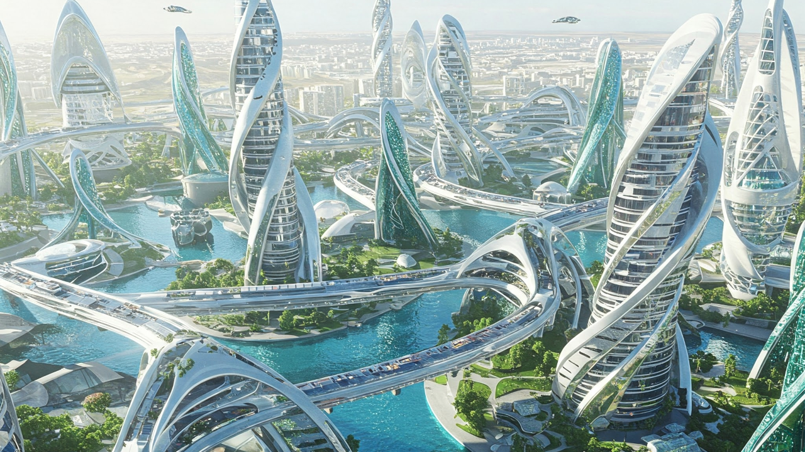
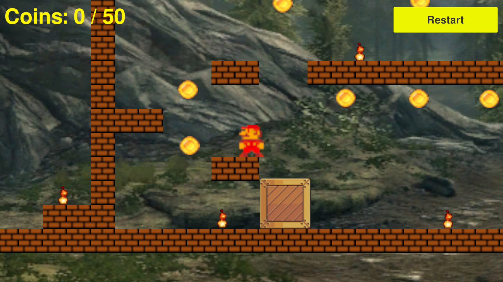

# Mini Version of Mario Bros

## Game Design Document

**DOWNLOAD: [Game_Design_Document.pdf](Game_Design_Document.pdf)**

**YouTube Video: [https://youtu.be/J8j1f7ZX2RE](https://youtu.be/J8j1f7ZX2RE)**

**GitHub Repository: [https://github.com/jckuri/mini_mario_bros](https://github.com/jckuri/mini_mario_bros)**

A GDD (game design document) is a highly descriptive, living document of the design of a video game. It helps to define the game details and features you intend for your game.

Completing a draft of this document upfront and then revisiting it to add and update it during your game development process is recommended. The final version of this document does not necessarily need to represent the final version of your game.

While not all of this information will directly impact your finished 2D Platformer Game build, it will help you plan the project, source the assets, and develop the game.

Please complete all of the numbered bullet points below. 

Table Of Contents

[Game Design Sketch](#game-design-sketch) 
[Game Concept](#game-concept) 
[Game Mechanics](#game-mechanics) 
[Optional: Standout Suggestions](#optional-standout-suggestions) 

### Game Design Sketch

This section includes at least one game design sketch that you create. It communicates your ideas for the game, such as its appearance, structure, and behavior. The sketch(es) need to show 3 tile map layers and 2 or more user interface elements. Optionally, the sketch(es) may include additional elements as you like. 

1. Add your sketch(es) here

Motion parallax has 3 layers:

**Midground layer**

**Cloud layer**

The cloud layer has fully transparent pixels, partially transparent pixels, and fully opaque pixels representing the clouds, which are in the middle of the midground layer and the forest layer.

**Forest layer**

The game has blocks, fires, coins, crates, and the player Mario. The UI has 2 elements: The Restart button and a text with information about the coins collected and the total amount of coins to be collected.

### Game Concept

This section describes the game’s story, environment, characters, etc.

2. What is the storyline or narrative of your game? 
For example, this is a pirate game on a pirate ship. Your playable character is a good pirate.

Your answer here: 

The video game is a mini version of Mario Bros, which is a very popular video game. This video game was programmed just for educational purposes. I will never sell it. So, I think there are no copyright issues due to the fact this is a clone of Mario Bros.

3. What are the main characters and objects in your game, and what roles do they play in the story and gameplay? 
For example, the playable character is an old pirate, the enemy is a parrot, and the intractable objects are collectible gold coins.

Your answer here: 

The main character is Mario who has to avoid the fires and collect all the 50 coins in order to win the videogame. Correctly using the 3 crates in the game is mandatory. Otherwise you won’t be able to solve the puzzle of collecting all the 50 coins.

### Game Mechanics

This section includes the core gameplay mechanics, input controls, and how the player interacts with the game.

4. What is the complete list of input actions that the player can perform, and how do these actions impact the game world? 
For example, the left arrow key moves the playable character to the left. If a platform blocks the playable character’s path, movement is not allowed.

Your answer here: 

Mario can move with the left arrow and the right arrow. Mario can jump with the up arrow. Mario can push the crates by walking toward them.

5. What is the typical gameplay loop (repeated actions) for the player? 
For example, the player moves to collect the gold coin pickup objects and to avoid touching the enemy.

Your answer here: 

Mario has to avoid the fires and collect all the 50 coins in order to win the videogame. Correctly using the 3 crates in the game is mandatory. Otherwise you won’t be able to solve the puzzle of collecting all the 50 coins.

### Optional: Standout Suggestions

This section contains "Standout Suggestions" for your game. These are game mechanics or other game features that aren't necessary for your game, but that would be great additions if you have the spare time. Adding such extras can really make your game shine. So, if you complete your game ahead of schedule, you might think about adding one or more of these ideas. For example, the following are standout suggestions that are relevant for a 2D Platformer type of game. 

6. Playable Character Double Jump

	Not implemented.

7. Breakable Crate Object

	Not implemented.

8. Enemy Character AI

Fires can patrol. They walk side to side over and over again. This is a very basic behavior.

